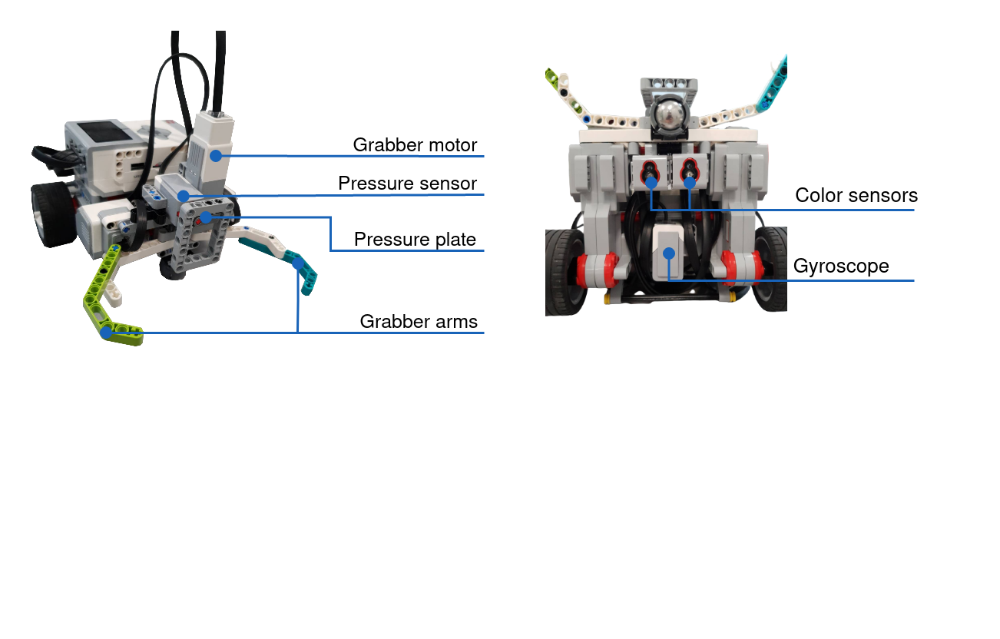

# Introduction to Embodied Artificial Intelligence (T550067101)
A search and rescue mission, is a problem which revolves around an agent locating some subject and transporting it from one opsition, back to the agent's initial position.
This projects attempts to execute such a mission, where: the agent is a LEGO® MINDSTORMS® EV3 robot(also referred to as `aibot`) and the subject is a tomato paste can. 

The solution is two part: Software design and hardware design.

The **software design** consists of two elements: 
1. A state machine which handles the behaviors and state transitions necessary when encountering different challenges in the environment.
2. A layered software architecture which provides abstractions between the hardware interface and the behavior layer. 

Here the behavior layer provides high level functionalities such as: `line_follow()` and `grab_can()`. 
These are build on a control layer which utilizes a hardware interface provided by the 
[python-ev3dev2](https://ev3dev-lang.readthedocs.io/projects/python-ev3dev/en/stable/spec.html) library. 

The **hardware design** consists of three components:
1. A can grabber, which can attach the tomato can to the robot when a touch is registered.
2. Two color sensors which together make a line follower, providing the robot with the ability to navigate the environment.
3. A gyroscope for detecting if the environments angle changes, such that the robot can provide less or further motor torque.

The full documentation of the project can be seen [here](docs/report.pdf).

## Setup

In order to setup a system for this project perform the following steps
1. Flash a clean install of `ev3dev2` onto a micro SD card, as presented [here](https://www.ev3dev.org/docs/tutorials/connecting-to-the-internet-via-usb/).
2. Connect your computer and the EV3 controller, as described [here](https://www.ev3dev.org/docs/tutorials/connecting-to-the-internet-via-usb/)

