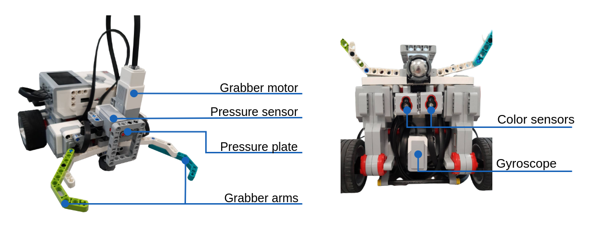

# Introduction to Embodied Artificial Intelligence (T550067101)
A search and rescue mission, is a problem which revolves around an agent locating some subject and transporting it from one opsition, back to the agent's initial position.
This projects attempts to execute such a mission, where: the agent is a LEGO® MINDSTORMS® EV3 robot(also referred to as `aibot`) and the subject is a tomato paste can. 

The solution si two part: Software design and hardware design.
The **software design** is two part: 
1. A state machine which handles the behaviors and state transitions necessary when encountering different challenges in the environment.
2. A layered software architecture which provides abstractions between the hardware interface and the behavior layer. 
Here the behavior layer provides high level functionalities such as: `line_follow()` and `grab_can()`.
The **hardware design** consists of 
